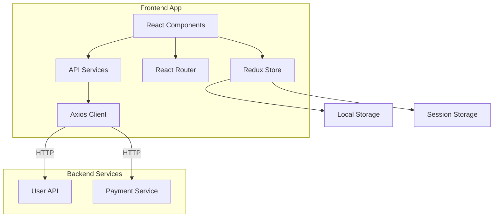
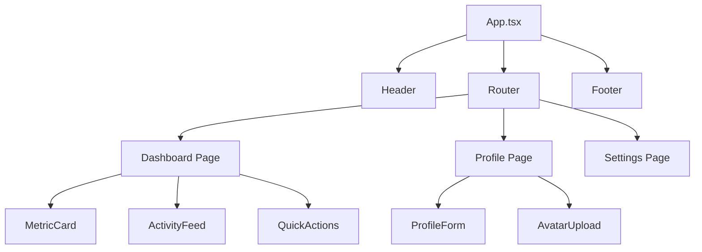
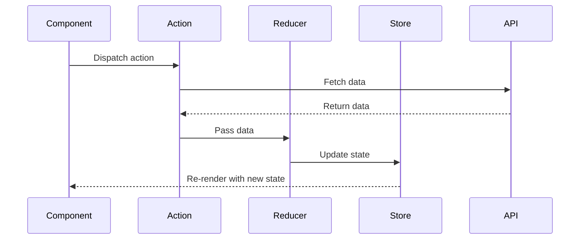

# Development Guide

## Setup

### Prerequisites

- Node.js 20+
- npm or yarn
- Git

### Installation

```bash
# Clone repository
git clone https://github.com/your-org/frontend-app.git
cd frontend-app

# Install dependencies
npm install

# Copy environment variables
cp .env.example .env.local

# Start development server
npm run dev
```

The app will be available at `http://localhost:5173`

## Development Workflow

### Code Organization

We follow a feature-based structure where related components, hooks, and logic are grouped together.

**Example Feature Structure:**

```
src/features/dashboard/
├── components/
│   ├── MetricCard.tsx
│   ├── ActivityFeed.tsx
│   └── QuickActions.tsx
├── hooks/
│   └── useDashboardData.ts
├── services/
│   └── dashboardService.ts
├── types/
│   └── dashboard.types.ts
└── DashboardPage.tsx
```

### Creating Components

Use functional components with TypeScript:

```tsx
import { FC } from 'react';

interface ButtonProps {
  label: string;
  variant?: 'primary' | 'secondary';
  onClick?: () => void;
}

export const Button: FC<ButtonProps> = ({ 
  label, 
  variant = 'primary',
  onClick 
}) => {
  return (
    <button
      className={`btn btn-${variant}`}
      onClick={onClick}
    >
      {label}
    </button>
  );
};
```

### State Management

We use Redux Toolkit for global state:

```typescript
// src/features/auth/authSlice.ts
import { createSlice, PayloadAction } from '@reduxjs/toolkit';

interface AuthState {
  user: User | null;
  isAuthenticated: boolean;
}

const initialState: AuthState = {
  user: null,
  isAuthenticated: false,
};

export const authSlice = createSlice({
  name: 'auth',
  initialState,
  reducers: {
    setUser: (state, action: PayloadAction<User>) => {
      state.user = action.payload;
      state.isAuthenticated = true;
    },
    logout: (state) => {
      state.user = null;
      state.isAuthenticated = false;
    },
  },
});

export const { setUser, logout } = authSlice.actions;
export default authSlice.reducer;
```

### API Integration

Use axios with service abstraction:

```typescript
// src/services/userService.ts
import axios from 'lib/axios';
import { User } from 'types/user.types';

export const userService = {
  getCurrentUser: async (): Promise<User> => {
    const { data } = await axios.get('/users/me');
    return data;
  },

  updateProfile: async (userId: string, updates: Partial<User>): Promise<User> => {
    const { data } = await axios.put(`/users/${userId}`, updates);
    return data;
  },
};
```

### Custom Hooks

Create reusable hooks for common patterns:

```typescript
// src/hooks/useAuth.ts
import { useSelector, useDispatch } from 'react-redux';
import { RootState } from 'store';
import { setUser, logout } from 'features/auth/authSlice';

export const useAuth = () => {
  const dispatch = useDispatch();
  const { user, isAuthenticated } = useSelector((state: RootState) => state.auth);

  const login = (userData: User) => {
    dispatch(setUser(userData));
  };

  const signOut = () => {
    dispatch(logout());
  };

  return {
    user,
    isAuthenticated,
    login,
    logout: signOut,
  };
};
```

## Styling Guidelines

### Tailwind CSS

Use utility classes for styling:

```tsx
<div className="flex items-center justify-between p-4 bg-white rounded-lg shadow-md">
  <h2 className="text-xl font-semibold text-gray-800">Title</h2>
  <button className="px-4 py-2 text-white bg-blue-600 rounded hover:bg-blue-700">
    Action
  </button>
</div>
```

### Custom Styles

For complex components, use CSS modules:

```tsx
// Component.tsx
import styles from './Component.module.css';

export const Component = () => (
  <div className={styles.container}>
    <h1 className={styles.title}>Hello</h1>
  </div>
);
```

```css
/* Component.module.css */
.container {
  max-width: 1200px;
  margin: 0 auto;
}

.title {
  font-size: 2rem;
  color: #333;
}
```

## Code Quality

### Linting

```bash
# Run ESLint
npm run lint

# Fix auto-fixable issues
npm run lint:fix
```

### Type Checking

```bash
# Run TypeScript compiler
npm run type-check
```

### Formatting

We use Prettier for code formatting:

```bash
# Check formatting
npm run format:check

# Fix formatting
npm run format
```

## Git Workflow

### Branch Naming

- `feature/` - New features
- `bugfix/` - Bug fixes
- `hotfix/` - Urgent production fixes
- `refactor/` - Code refactoring

### Commit Messages

Follow conventional commits:

```bash
feat: add user profile page
fix: resolve login redirect issue
docs: update API integration guide
style: format code with prettier
refactor: extract user service logic
test: add tests for dashboard component
```

### Pull Requests

1. Create feature branch from `main`
2. Implement changes with tests
3. Run linter and tests locally
4. Push and create PR
5. Request review from team
6. Address feedback
7. Merge when approved

## Application Architecture



## Component Hierarchy



## State Management Flow


