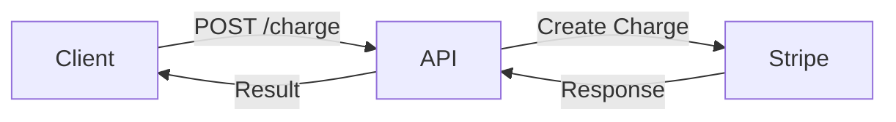

# 1. Use Stripe as Primary Payment Provider

Date: 2025-01-15

## Status

Accepted

## Context

We need to select a payment processing provider for our platform. The payment service must handle:

- Credit card payments
- Subscription billing
- International payments
- PCI compliance
- Webhook notifications
- Refunds and chargebacks

Key requirements:
- High reliability (99.99% uptime)
- Strong security and PCI compliance
- Good developer experience
- Reasonable pricing
- International support

## Decision

We will use **Stripe** as our primary payment provider.

## Consequences

### Positive

- **PCI Compliance**: Stripe handles PCI DSS compliance, reducing our security burden
- **Developer Experience**: Excellent API documentation and SDKs for multiple languages
- **Feature Rich**: Supports subscriptions, invoicing, payment methods, webhooks
- **Reliability**: Industry-leading uptime and infrastructure
- **International**: Supports 135+ currencies and multiple payment methods
- **Testing**: Great sandbox environment for development and testing
- **Community**: Large community and extensive resources

### Negative

- **Vendor Lock-in**: Significant effort required to switch providers later
- **Pricing**: 2.9% + $0.30 per transaction (higher than some competitors)
- **Dependency**: Our payment processing depends on Stripe's availability
- **Learning Curve**: Team needs to learn Stripe-specific concepts

### Neutral

- **Integration Effort**: 2-3 weeks estimated for initial integration
- **Maintenance**: Ongoing webhook management and API version updates required

## Alternatives Considered

### PayPal
- **Pros**: Well-known brand, customer trust
- **Cons**: More complex API, worse developer experience
- **Decision**: Rejected due to poor API design

### Square
- **Pros**: Good for physical retail
- **Cons**: Less feature-rich for online payments
- **Decision**: Rejected as we're primarily online

### Adyen
- **Pros**: Enterprise-grade, excellent international support
- **Cons**: Higher pricing, more complex integration
- **Decision**: Rejected due to complexity and cost

## Documentation Standards

We recommend using Mermaid diagrams to visualize payment flows. Here's an example of how to document Mermaid syntax:

````markdown

````

Would turn into


This allows you to show diagram examples in documentation without them being auto-rendered.
