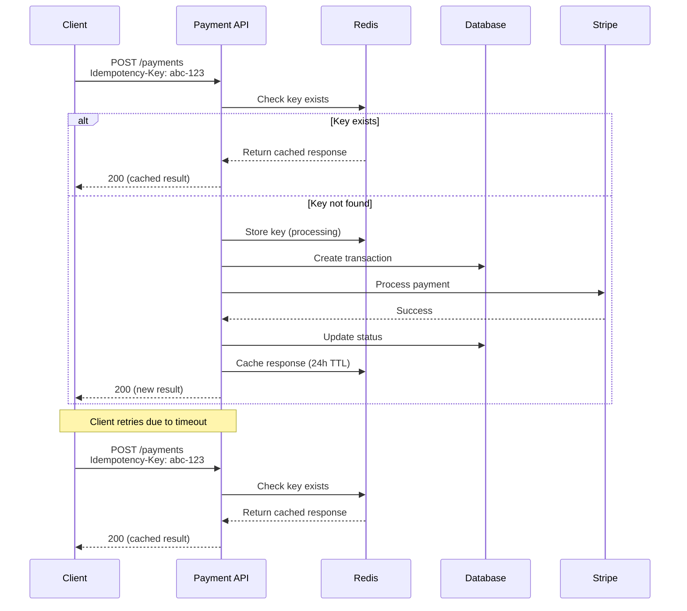
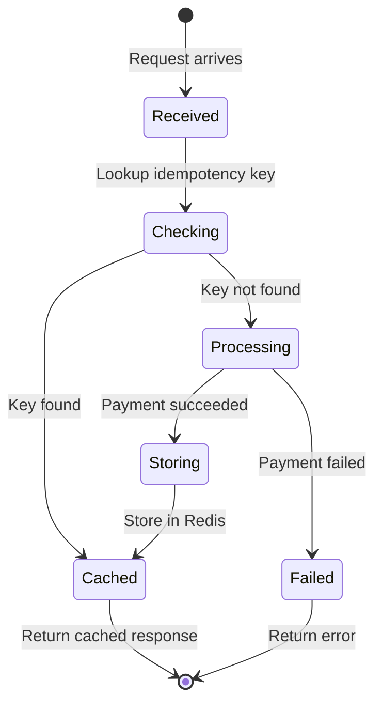

# 2. Implement Idempotency for Payment Operations

Date: 2025-02-20

## Status

Accepted

## Context

Network failures, client retries, and distributed system challenges can cause duplicate payment requests. Processing the same payment twice would result in:

- Double charging customers
- Financial discrepancies
- Customer complaints and chargebacks
- Loss of trust

We need a mechanism to ensure payment operations are processed exactly once, even if the request is received multiple times.

## Decision

We will implement **idempotency** for all payment operations using:

1. **Idempotency Keys**: Clients must provide a unique `Idempotency-Key` header with each request
2. **Key Storage**: Store idempotency keys with their results in Redis with 24-hour TTL
3. **Key Format**: UUID v4 generated by the client
4. **Response Caching**: Cache successful responses for duplicate requests

### Implementation Flow



### State Machine



## Consequences

### Positive

- **Prevents Duplicates**: Eliminates risk of double-charging customers
- **Safe Retries**: Clients can safely retry failed requests
- **Better UX**: Users won't be charged multiple times due to network issues
- **Audit Trail**: Idempotency keys provide tracking for debugging

### Negative

- **Added Complexity**: Additional logic for key validation and storage
- **Redis Dependency**: System depends on Redis availability
- **Client Burden**: Clients must generate and manage idempotency keys
- **Storage Overhead**: Redis memory usage for caching responses

### Neutral

- **Performance**: Minimal impact (~5ms overhead for Redis lookup)
- **Implementation Time**: 3-5 days for initial implementation

## Implementation Notes

### Redis Key Structure
```
payment:idempotency:{key} -> {status, response, timestamp}
TTL: 24 hours
```

### Error Handling
- Missing key: Return 400 Bad Request
- Expired key: Process as new request
- Conflicting request: Return 409 Conflict if operation in progress

## References

- [Stripe Idempotency](https://stripe.com/docs/api/idempotent_requests)
- [RFC 7231 - HTTP Idempotent Methods](https://tools.ietf.org/html/rfc7231#section-4.2.2)
