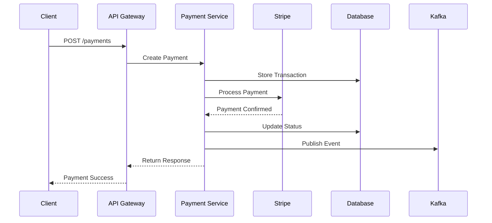
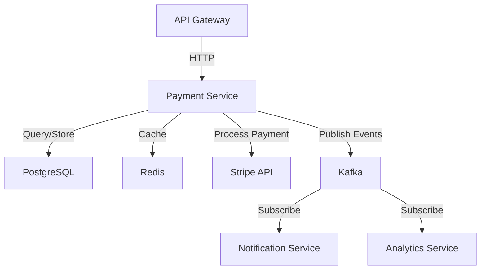

# Architecture

## System Design

The Payment Service follows a hexagonal architecture pattern with clear separation of concerns.

```
┌─────────────────────────────────────────┐
│         API Gateway Layer               │
│  (REST API, GraphQL, gRPC)              │
└───────────────┬─────────────────────────┘
                │
┌───────────────▼─────────────────────────┐
│       Application Services              │
│  - Payment Processing                   │
│  - Refund Management                    │
│  - Webhook Handler                      │
└───────────────┬─────────────────────────┘
                │
┌───────────────▼─────────────────────────┐
│          Domain Layer                   │
│  - Payment Entity                       │
│  - Transaction Aggregate                │
│  - Payment Rules                        │
└───────────────┬─────────────────────────┘
                │
┌───────────────▼─────────────────────────┐
│      Infrastructure Layer               │
│  - PostgreSQL Repository                │
│  - Stripe Adapter                       │
│  - Event Publisher                      │
└─────────────────────────────────────────┘
```

## Component Responsibilities

### API Gateway Layer
Handles incoming HTTP requests and routes them to appropriate service handlers. Implements authentication, rate limiting, and request validation.

### Application Services
Orchestrates business logic and coordinates between domain entities and infrastructure adapters.

### Domain Layer
Contains core business logic, entities, and domain rules. Independent of external frameworks and libraries.

### Infrastructure Layer
Implements technical capabilities like persistence, external integrations, and event publishing.

## Data Flow

1. Client initiates payment request
2. API Gateway validates and authenticates request
3. Payment Service creates transaction record
4. External payment provider processes payment
5. Webhook confirms payment status
6. Event published to Kafka
7. Response returned to client

## System Flow Diagram



## Component Architecture


